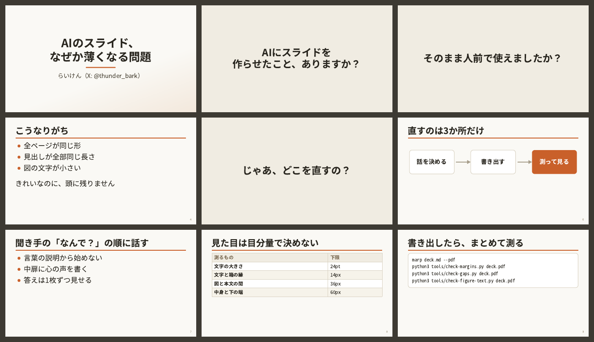

# laiken-marp-skill

らいけん（X: [@thunder_bark](https://x.com/thunder_bark)）が登壇スライドを Marp で作るときの、ストーリー・図・デザインバランスの型です。AIエージェント（Claude Code など）に読ませるスキルの形にしてあり、人が読んでもそのまま使えます。

みのるん（[@minorun365](https://x.com/minorun365)）の [minorun-marp-skill](https://github.com/minorun365/minorun-marp-skill) をフォークして改造しました。



## 元リポジトリからの主な変更

| 項目 | minorun-marp-skill | laiken-marp-skill |
|---|---|---|
| テーマ | 黒地＋シアン（minorun-dark） | 生成りの地＋テラコッタ（laiken-light） |
| 書体 | 丸ゴシック | サンセリフのみ（ヒラギノ角ゴ／游ゴシック／Noto Sans CJK） |
| 本文 | 26pt | 36pt。下限24pt |
| 大原則 | ― | 5歳児でもわかるスライド（2秒で理解、1項目20文字、箇条書き4行まで） |
| 図 | marker の矢印、16pt下限 | line＋polygon の矢印、viewBox幅1140、24pt下限 |
| 検査 | 黒地専用 | ページの地の色を自動で取る（明るい地でも黒地でも測れる） |

## 中身

| 場所 | 内容 |
|---|---|
| `skills/laiken-slide-story` | 5歳児原則、らいけんのデッキの約束、つかみ、中扉、段階的な開示、見出しの文体、締め方、尺の見積り |
| `skills/laiken-slide-figures` | 図の情報量の絞り方、laiken-light の配色でのSVGパターン、文字サイズの下限、挿絵の置き方 |
| `skills/laiken-slide-design` | 文字サイズと1スライドの量、余白の測り方、縦のバランス、配色、表とコードの型、Marpの罠 |
| `theme/laiken-light.css` | 生成りの地にテラコッタの Marp テーマ |
| `tools/` | 書き出したPDFとSVGを実測する検査スクリプト |
| `examples/sample` | 見本デッキ。`examples/broken` は検査が反応することを確かめるための、わざと崩した版 |

## 使い方

Claude Code で使うなら、`skills/` の3つを自分のスキル置き場へコピーします。

```bash
cp -r skills/* ~/.claude/skills/
```

テーマと検査スクリプトは、スライドを置くリポジトリへ `theme/` と `tools/` ごとコピーしてください。

```bash
marp --no-stdin deck.md --pdf --theme theme/laiken-light.css --allow-local-files

python3 tools/check-margins.py deck.pdf         # 中身の下端と右端の空き
python3 tools/check-gaps.py deck.pdf            # 図や箱と、隣の本文の間隔
python3 tools/check-figure-text.py deck.pdf     # 24pt未満の文字、箱の縁に詰まった文字
node tools/check-svg-box-fit.mjs images/*.svg   # SVGの文字が箱に収まっているか
python3 tools/check-reuse-diff.py new.md old.md # 流用したスライドの、見出しと図の対応
```

検査スクリプトが使うもの:

- [Marp CLI](https://github.com/marp-team/marp-cli)（`npm i -g @marp-team/marp-cli`）と Chrome / Chromium
- poppler（`pdftoppm` `pdfinfo`）と mupdf-tools（`mutool`）。macOS なら `brew install poppler mupdf-tools`
- Python 3 と Pillow

`check-svg-box-fit.mjs` は Marp CLI に同梱の puppeteer-core を借ります。場所が違う環境では `MARP_NODE_MODULES` と `CHROME_PATH` で指定できます。Claude Code のクラウド環境では `/opt/pw-browsers/chromium` を自動で使います（Marp CLI には `CHROME_PATH=/opt/pw-browsers/chromium` を渡してください）。

## 挿絵について

見本デッキは「いらすとや」の挿絵を右下に置く想定です。画像は同梱していないので、書き出す前に取得してください。利用条件は各自で確かめてください。取得しなくても、挿絵の無い状態で書き出せます（プレビュー画像は挿絵なしで作っています）。

```bash
sh examples/sample/fetch-illustrations.sh
```

## License

Apache License 2.0。原著作物は Copyright 2026 Minoru Onda。改変部分は Copyright 2026 らいけん。変更点は `NOTICE` を参照してください。
