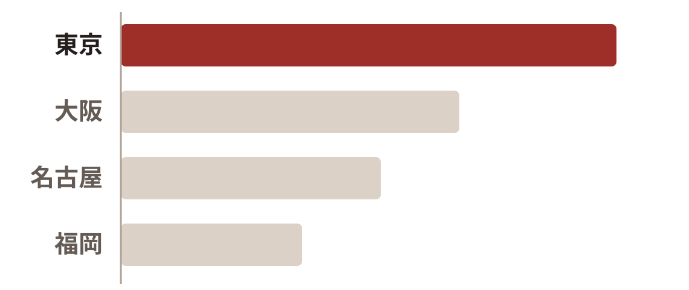
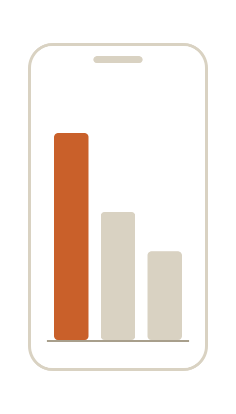
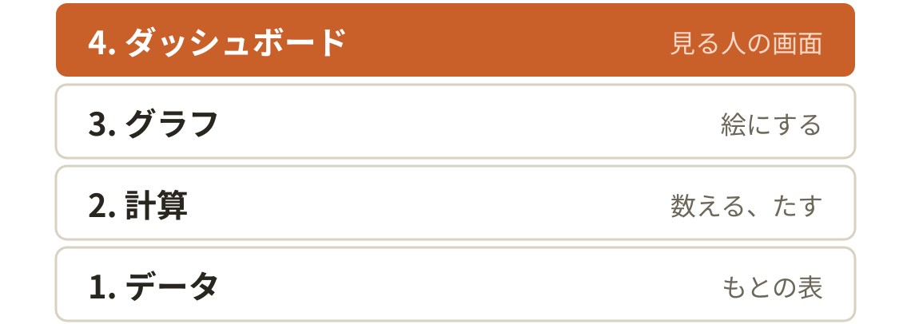
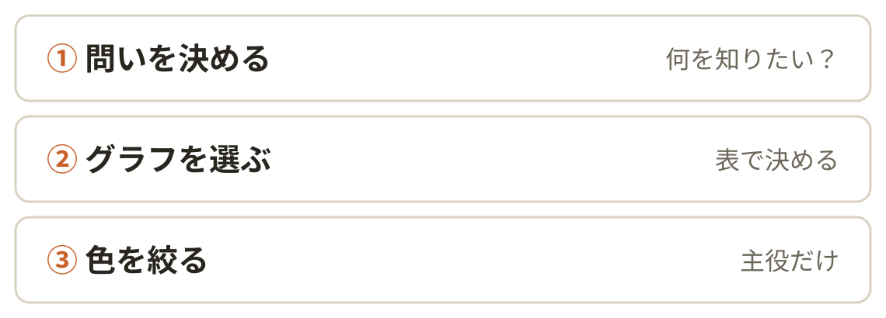
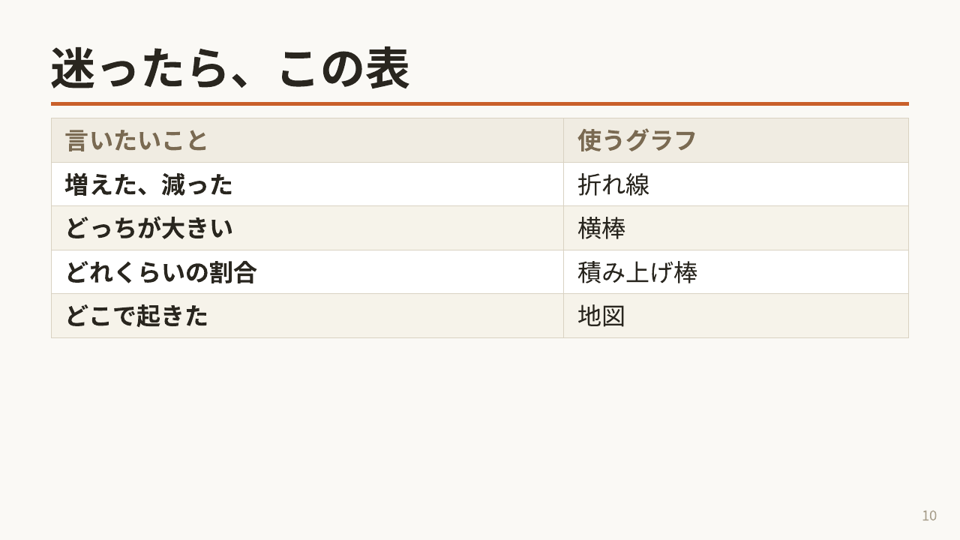
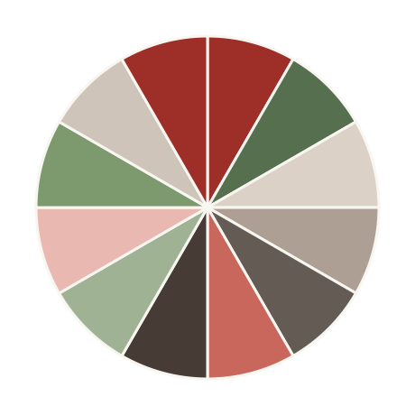

<!-- _class: top -->
<!-- _paginate: false -->

# laiken-marp-skill 型カタログ

らいけん（X: @thunder_bark）

---

<!-- _class: crosshead -->
<!-- _header: "" -->

# デモで使わなかった型を、 1枚ずつ見てみよう

---

<!-- _class: image-full -->
<!-- _header: 型：image-full（テーマ） -->

# 東京だけ、とびぬけて大きい

---

<!-- _class: split -->
<!-- _header: 型：split（テーマ） -->

# スマホでも1本だけ

- 画面が小さいほど
- グラフは1つに絞る

---

<!-- _header: 型：横帯スタック（図） -->

# ダッシュボードは4階建て

---

<!-- _header: 型：番号付きラベル（図） -->

# 作る順番は3つ

---

<!-- _header: 型：箱の外の上にラベル（図） -->

# データが画面に届くまで

---

<!-- _header: 型：挿絵（右下） -->

# 最後は目で見る

- 隣の人に見せる
- 2秒で分かるか聞く

---

<!-- _header: 型：スクリーンショットを中央に -->

# 表のページは、こうなる

---

<!-- _header: 型：表の注目行に網掛け -->

# 迷ったら、この表

| 言いたいこと | 使うグラフ |
| --- | --- |
| 増えた、減った | 折れ線 |
| どっちが大きい | 横棒 |
| どれくらいの割合 | 積み上げ棒 |
| どこで起きた | 地図 |

---

<!-- _header: 型：引用枠（実在の一言だけ） -->

# 頼んだのは、この一言だけ

> これforkしてLaiken用に改造して

<!-- このスキルを作ったときに、らいけんが Claude Code に送った依頼文そのまま -->

---

<!-- _header: 型：h2（小見出し） -->

# グラフは2つに分ける

## 見せる用

1つだけ、画面いっぱいに

## 調べる用

残りは全部、別のシートへ

---

<!-- _header: 型：吹き出しの寸劇 -->

# 会議でよくある光景

---

<!-- _header: 型：想定反論（1枚目） -->

# 9個とも大事なんですけど！

- 全部、頑張って作った
- 消すのはもったいない

---

<!-- _header: 型：想定反論（2枚目） -->

# 消さなくて大丈夫です

- 別のシートに移すだけ
- 見たい人は、そこで見る

---

<!-- _header: 型：誤解の先回り -->

# もしかして、 これを思い浮かべてませんか…？

---

<!-- _header: 型：ステップバーで現在地 -->

# 1つを、画面いっぱいに

- 小さいグラフを並べない
- 主役は画面の半分以上

---

<!-- _header: 型：用語の導入 -->

# 見る人が最初に見る「主役」

- 画面で一番大きい
- 色がついている

主役は、1画面に1つだけ

---

<!-- _class: crosshead -->
<!-- _header: "" -->

# 気になる型から、 1つ使ってみませんか？
