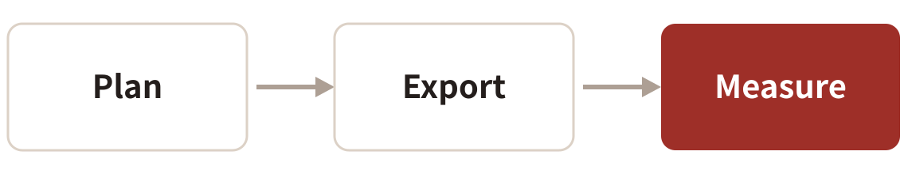

<style>
/* 図が主役のスライド。見出しとの間に36px以上、下にも余白 */
img[alt~="center"] { display:block; margin:48px auto 0; }
/* 挿絵。右端は本文の左右余白より内側へ。インラインの style 属性は Marp が落とすのでクラスで書く */
.ill { position:absolute; right:96px; bottom:80px; width:240px; }
.ill.sm { width:190px; }
</style>

<!-- _class: top -->
<!-- _paginate: false -->

# <span class="ja">AIのスライド、<br>なぜか薄くなる問題</span><span class="en">Why AI-made slides feel thin</span>

<span class="ja">らいけん（X: @thunder_bark）</span><span class="en">Laiken (X: @thunder_bark)</span>

---

<!-- _class: crosshead -->

# <span class="ja">AIにスライドを<br>作らせたこと、ありますか？</span><span class="en">Ever had AI make your slides?</span>

---

<!-- _class: crosshead -->

# <span class="ja">そのまま人前で使えましたか？</span><span class="en">Could you present them as-is?</span>

---

# <span class="ja">こうなりがち</span><span class="en">What usually happens</span>

- <span class="ja">全ページが同じ形</span><span class="en">Every page has the same shape</span>
- <span class="ja">図の文字が小さい</span><span class="en">Figure text is too small</span>

<span class="ja">きれいなのに、頭に残りません</span><span class="en">Pretty, yet nothing sticks</span>


---

<!-- _class: crosshead -->

# <span class="ja">じゃあ、どこを直すの？</span><span class="en">So what do we fix?</span>

---

# <span class="ja">直すのは3か所だけ</span><span class="en">Just three things to fix</span>




---

# <span class="ja">聞き手の「なんで？」の順に話す</span><span class="en">Follow the audience's “why?”</span>

- <span class="ja">言葉の説明から始めない</span><span class="en">Don't open with definitions</span>
- <span class="ja">中扉に心の声を書く</span><span class="en">Put their inner voice on dividers</span>
- <span class="ja">答えは1枚ずつ見せる</span><span class="en">Reveal answers one slide at a time</span>


---

# <span class="ja">見た目は目分量で決めない</span><span class="en">Don't eyeball the layout</span>

| <span class="ja">測るもの</span><span class="en">What to measure</span> | <span class="ja">下限</span><span class="en">Minimum</span> |
| --- | --- |
| <span class="ja">文字の大きさ</span><span class="en">Text size</span> | 24pt |
| <span class="ja">文字と箱の縁</span><span class="en">Text to box edge</span> | 14px |
| <span class="ja">図と本文の間</span><span class="en">Figure to body text</span> | 36px |
| <span class="ja">中身と下の端</span><span class="en">Content to bottom edge</span> | 60px |

---

# <span class="ja">書き出したら、まとめて測る</span><span class="en">Export, then measure it all</span>

```bash
marp deck.md --pdf
python3 tools/check-margins.py deck.pdf
python3 tools/check-gaps.py deck.pdf
python3 tools/check-figure-text.py deck.pdf
```

---

# <span class="ja">…測れば完成！ではないんです</span><span class="en">…but measuring isn't the finish line</span>

- <span class="ja">測れるのは、描けた物だけ</span><span class="en">Tools see only what got drawn</span>
- <span class="ja">消えた矢印は見逃す</span><span class="en">A missing arrow slips by</span>
- <span class="ja">最後は**自分の目で見る**</span><span class="en">Finally, **check with your eyes**</span>


---

<!-- _class: crosshead -->

# <span class="ja">まずは手元の1本を<br>測ってみませんか？</span><span class="en">Why not measure one deck today?</span>
