# pstack skill map

[日本語](skill-map.ja.md)

Diagrams of how the 47 skills and 2 agents in `pstack-cc/plugin/` (the Claude Code build of the Cursor plugin pstack) relate to each other, and how each skill drives its subagents.

## 1. Overview

The entry point is `/poteto-mode`. It picks a playbook for the kind of work, and each playbook step calls workflow skills such as how and architect. Every skill reads `claude-code.md` (the Cursor → Claude Code mapping) first, and picks models from `~/.claude/pstack-models.md`.

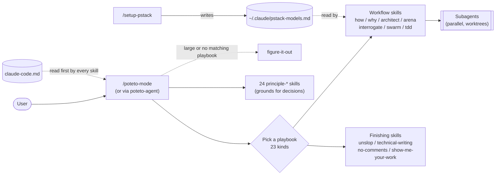

## 2. How skills reference each other

Extracted from places where a SKILL.md names another skill. An arrow means "calls or refers to". poteto-mode refers to every principle-* skill, so only references from other skills are drawn.

Colors: green = entry points, purple = workflows (use subagents), orange = writing and quality, grey = setup and other. Hexagons are agent definitions (`plugin/agents/`).

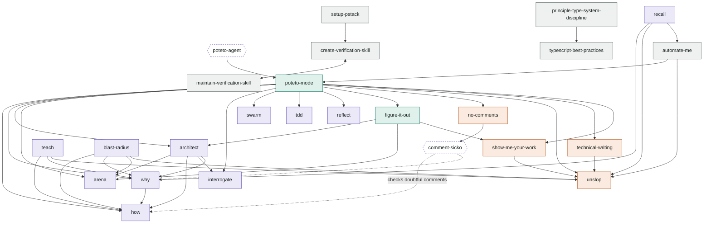

bro and make-bot-ui stand alone with no references.

## 3. Agent flow in each workflow

Models in parentheses are the role defaults from `pstack-models.md`. Every workflow launches its agents in parallel with `run_in_background: true`, and the parent merges the results.

### how (explaining how something works)

A simple question gets one explainer. A complex one is explored from 2 to 4 angles first, then merged.

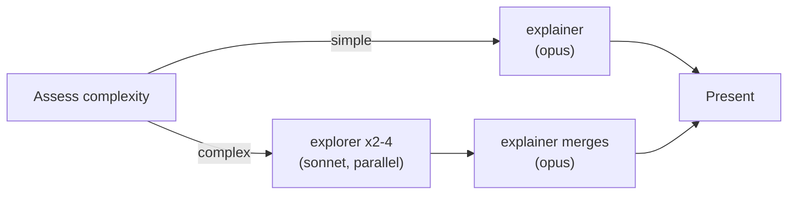

### why (history and rationale)

Checks which MCPs are available and starts one investigator per kind of evidence.

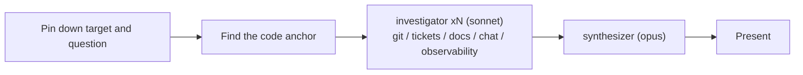

### arena (competing candidates)

Several models solve the same task. Pick a base, then graft the best parts of the others into it.

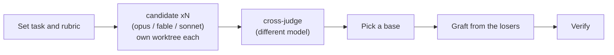

### architect (design before code)

Calls arena for the design sketch. If implementation breaks down, start over from how.

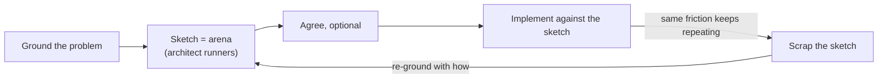

### interrogate (adversarial review)

Reviewers attack from separate angles at once, and the parent makes the final call.

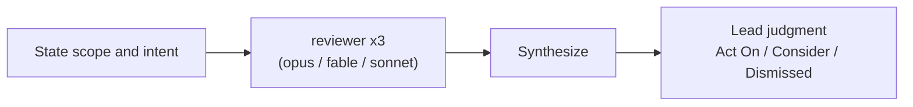

### swarm (parallel workers)

Three shapes: partition, race, or both. Runs in local worktrees instead of Cursor's cloud, about 5 at a time.

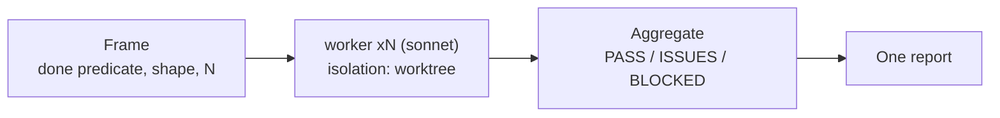

### reflect (retrospective)

Reads the transcript through three lenses and turns each learning into an edit to an existing skill.

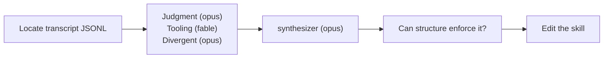

### no-comments (comment removal)

comment-sicko only reports. The parent makes the fixes.

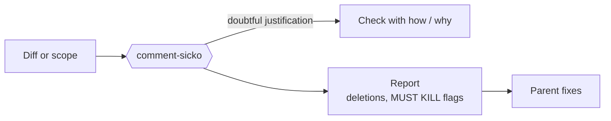

## 4. Example: one pass through the Feature playbook

The steps poteto-mode follows for a new feature (`plugin/skills/poteto-mode/playbooks/feature.md`). This shows most clearly the order in which skills chain.

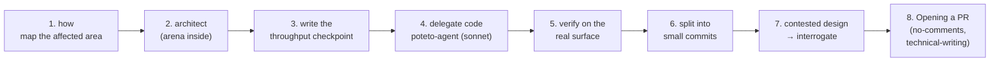

| Playbook (selection) | Main skills called |
|---|---|
| Investigation | how, why |
| Bug fix | how, why → architect → tdd |
| Feature / Refactoring | how → architect → interrogate |
| Autonomous run / Orchestrate | swarm, show-me-your-work |
| No matching playbook, or large | figure-it-out (architect, arena, show-me-your-work) |

## 5. How this plugin is built

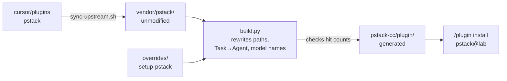

If upstream wording changes so a rewrite rule stops matching, the build fails.

---

The references in section 2 were collected by grepping SKILL.md files for skill names, so references that only mention a skill indirectly may be missing.
