# pstack スキル地図

[English](skill-map.en.md)

Cursor 用プラグイン pstack を Claude Code 向けに変換したもの(`pstack-cc/plugin/`)にある、スキル 47 個・エージェント 2 個の関係と、各スキルがサブエージェントをどう動かすかの図。

## 1. 全体像

入口は `/poteto-mode`。仕事の種類で playbook を選び、各ステップから how / architect などのワークフロースキルを呼ぶ。どのスキルも最初に `claude-code.md`(Cursor → Claude Code 対応表)を読み、モデル選択は `~/.claude/pstack-models.md` に従う。

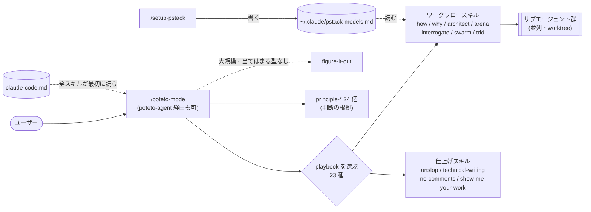

## 2. スキル同士の参照関係

SKILL.md 内で他スキルを名指ししている箇所を抜き出した。矢印は「呼ぶ/参照する」。principle-* は poteto-mode から全部参照されるので、ここでは他スキルからの参照だけ描いた。

色: 緑 = 入口、紫 = ワークフロー(サブエージェントを使う)、橙 = 文章・品質、灰 = 設定・その他。六角形はエージェント定義(`plugin/agents/`)。

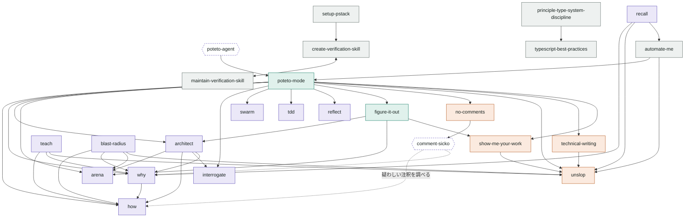

参照のない単独スキルは bro、make-bot-ui。

## 3. 各ワークフローのエージェントの流れ

括弧内は `pstack-models.md` の役割の既定モデル。どれも `run_in_background: true` で並列に起動し、親が結果をまとめる。

### how(仕組みの説明)

単純な質問は explainer 1 体だけ。複雑なら 2〜4 観点で探索してから統合。

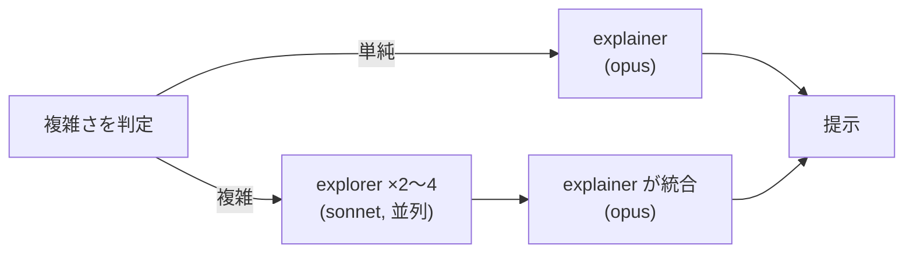

### why(経緯・理由の調査)

使える MCP を調べ、証拠の種類ごとに調査役を 1 体ずつ立てる。

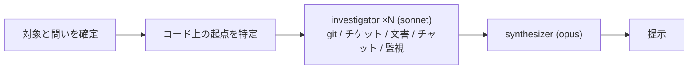

### arena(案の競作)

同じ課題を複数モデルに解かせ、土台を選んで他案の良い所を移植。

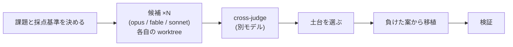

### architect(実装前の設計)

設計スケッチの段階で arena を呼ぶ。実装が破綻したら how からやり直し。

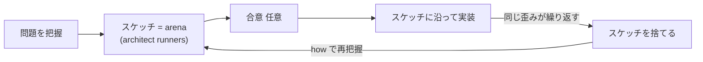

### interrogate(敵対的レビュー)

別々の観点のレビュアーが同時に突っ込み、最後に親が判断。

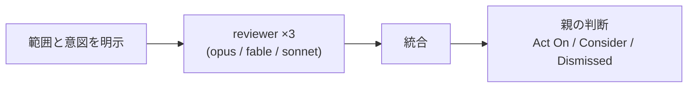

### swarm(並列ワーカー)

分担・競争・混合の 3 形。Cursor のクラウドの代わりに手元の worktree で、同時 5 体程度。

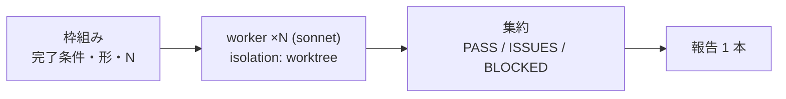

### reflect(振り返り)

会話ログを 3 つの観点で読み、学びを既存スキルの修正に落とす。

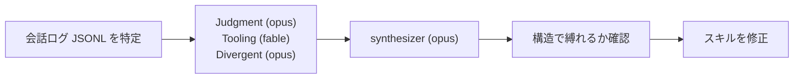

### no-comments(コメント削除)

comment-sicko は報告だけ。修正は親がする。

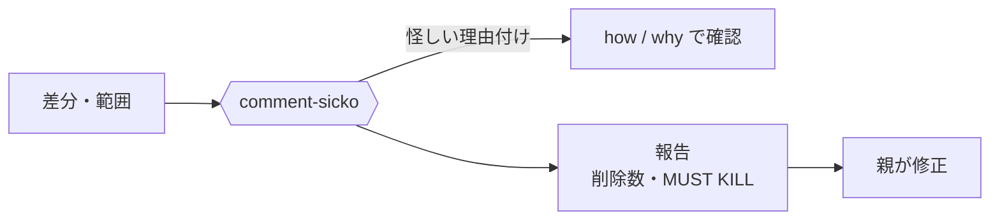

## 4. 例: Feature playbook の一周

poteto-mode が「新機能」と判定したときの手順(`plugin/skills/poteto-mode/playbooks/feature.md`)。スキルがどの順で連鎖するかが一番よく見える。

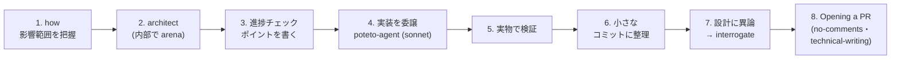

| playbook(一部) | 主に呼ぶスキル |
|---|---|
| Investigation | how, why |
| Bug fix | how, why → architect → tdd |
| Feature / Refactoring | how → architect → interrogate |
| Autonomous run / Orchestrate | swarm, show-me-your-work |
| 当てはまる型なし・大規模 | figure-it-out(architect, arena, show-me-your-work) |

## 5. このプラグインの作られ方

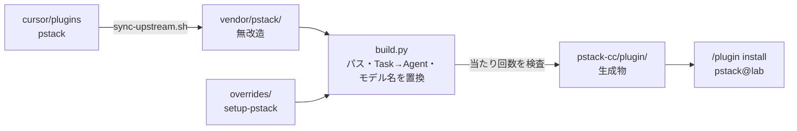

置換ルールが上流の文章変更で当たらなくなると build が失敗する。

---

2 の参照関係は SKILL.md 内の名指しを grep で拾ったもので、本文で間接的に触れているだけの参照は漏れている可能性がある。
